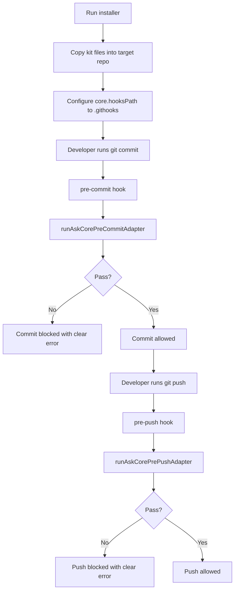

# How Agent Session Kit Works

This document explains the runtime flow in simple terms.

## Core Idea

The kit enforces three things:

1. You are working in the intended branch/worktree.
2. Session docs are updated when meaningful code changes happen.
3. These checks run automatically before commit and push.
4. Optional repo-level lock can override file context to prevent branch drift.
5. Optional repo-boundary tests can enforce architecture boundaries in CI.

The runtime lives in `ask-core/` so policy contracts and session behavior can be tested independently from hook wrapper scripts.
Session lifecycle depth is persisted with snapshot + journal files under `.ask/sessions/active-session.json`, `.ask/sessions/history.ndjson`, and `.ask/sessions/pending-transition.json`.
Lifecycle-aware `preflight` and `can-commit` checks use policy keys `allowed_preflight_states` and `allowed_can_commit_states` (default `active,paused`) to reject disallowed states (`blocked`, `closed`, `created`).
Pre-commit is ask-core-only (`ask pre-commit-check`) and pre-push is ask-core-only (`ask pre-push-check`).
Adapter command execution uses guarded runtime behavior: `180s` wall/no-output timeout with one automatic retry on detected stall before failing.

## Flow Overview



## Components

- Installer: `install-session-kit.mjs`
- Hook setup helper: `scripts/session/installHooks.mjs`
- Resume helper: `scripts/session/resumeSession.mjs`
- Change-log archiver: `scripts/session/archiveSessionLog.mjs`
- Task reminder helpers:
  - `scripts/session/nextTask.mjs`
  - `scripts/session/completeTask.mjs`
- Repo lock helpers:
  - `scripts/session/setRepoWorkContextLock.mjs`
  - `scripts/session/clearRepoWorkContextLock.mjs`
- Ask-core adapter wrappers:
  - `scripts/session/runAskCorePreCommitAdapter.mjs`
  - `scripts/session/runAskCorePrePushAdapter.mjs`
- Runtime operation state: `.ask/runtime/last-operation.json`
- Hook templates: `.githooks/pre-commit`, `.githooks/pre-push`
- Hook template: `.githooks/post-commit` (soft next-task reminder)
- Session templates: `docs/session/*`
- Standalone runtime package: `ask-core/*` (core session runtime, policy, and governance checks)

## Optional Repo-Level Lock

Set lock:

```bash
node scripts/session/setRepoWorkContextLock.mjs --branch <branch-name> --repo-suffix <path-suffix> --enforce-path-suffix true
```

Clear lock:

```bash
node scripts/session/clearRepoWorkContextLock.mjs
```

When enabled, `ask context verify` uses `git config` lock values (`session.workContextLock.*`) instead of `active-work-context.json`.

## Optional Repo Boundary Guards

Use this for architecture rules that are outside hook scope.

Pattern:

1. Define forbidden paths (or other boundary invariants).
2. Add deterministic tests that fail when violated.
3. Keep those tests in regular CI (`test:runtime` or `test:architecture`).

See `repo-boundary-guards.md` for reusable templates.

## Resume Snapshot

Use this to quickly rehydrate session context after interruptions:

```bash
node scripts/session/resumeSession.mjs
```

The output includes current branch, HEAD, active objective, next unchecked task, and latest verification command.

## Stall Recovery Diagnostics

If adapter execution appears stuck:

```bash
node ask-core/bin/ask.js session doctor
```

Doctor reads `.ask/runtime/last-operation.json` and reports latest runtime status, retry attempt metadata, and deterministic recovery guidance.

## Task Reminder Loop

Recommended flow:

```bash
node scripts/session/completeTask.mjs
```

This updates `tasks.md` and prints the next recommendation. A soft `post-commit` hook also prints the next task after each commit.

## What "Meaningful Change" Means

The freshness validator ignores changes to:

- `docs/session/*`
- `scripts/session/*`
- `.githooks/*`

If other files changed, it requires updates to:

- `docs/session/current-status.md`
- `docs/session/change-log.md`

Warning-level docs by default:

- `docs/session/tasks.md`
- `docs/session/open-loops.md`

Optional strict mode:

- `strictTasksDoc: true` in `docs/session/active-work-context.json`, or
- `SESSION_TASKS_STRICT=1`

With strict mode, `docs/session/tasks.md` is required (not warning-level).

## Bypass Behavior

Emergency bypass exists for controlled recovery:

- `SESSION_CONTEXT_BYPASS=1`
- `SESSION_DOCS_BYPASS=1`

Use bypass only when unavoidable and document why in `change-log.md`.
