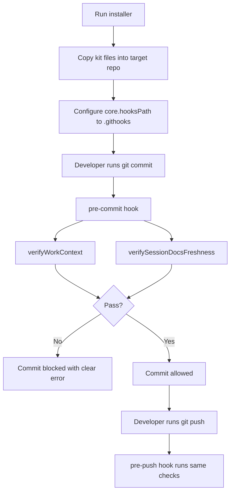

# How Agent Session Kit Works

This document explains the runtime flow in simple terms.

## Core Idea

The kit enforces three things:

1. You are working in the intended branch/worktree.
2. Session docs are updated when meaningful code changes happen.
3. These checks run automatically before commit and push.

## Flow Overview

## Components

- Installer: `install-session-kit.mjs`
- Hook setup helper: `kit/scripts/session/installHooks.mjs`
- Work context validator: `kit/scripts/session/verifyWorkContext.mjs`
- Session freshness validator: `kit/scripts/session/verifySessionDocsFreshness.mjs`
- Hook templates: `kit/.githooks/pre-commit`, `kit/.githooks/pre-push`
- Session templates: `kit/docs/session/*`

## What "Meaningful Change" Means

The freshness validator ignores changes to:

- `docs/session/*`
- `scripts/session/*`
- `.githooks/*`

If other files changed, it requires updates to:

- `docs/session/current-status.md`
- `docs/session/change-log.md`

Warning-level docs by default:

- `docs/session/tasks.md`
- `docs/session/open-loops.md`

Optional strict mode:

- `strictTasksDoc: true` in `docs/session/active-work-context.json`, or
- `SESSION_TASKS_STRICT=1`

With strict mode, `docs/session/tasks.md` is required (not warning-level).

## Bypass Behavior

Emergency bypass exists for controlled recovery:

- `SESSION_CONTEXT_BYPASS=1`
- `SESSION_DOCS_BYPASS=1`

Use bypass only when unavoidable and document why in `change-log.md`.
